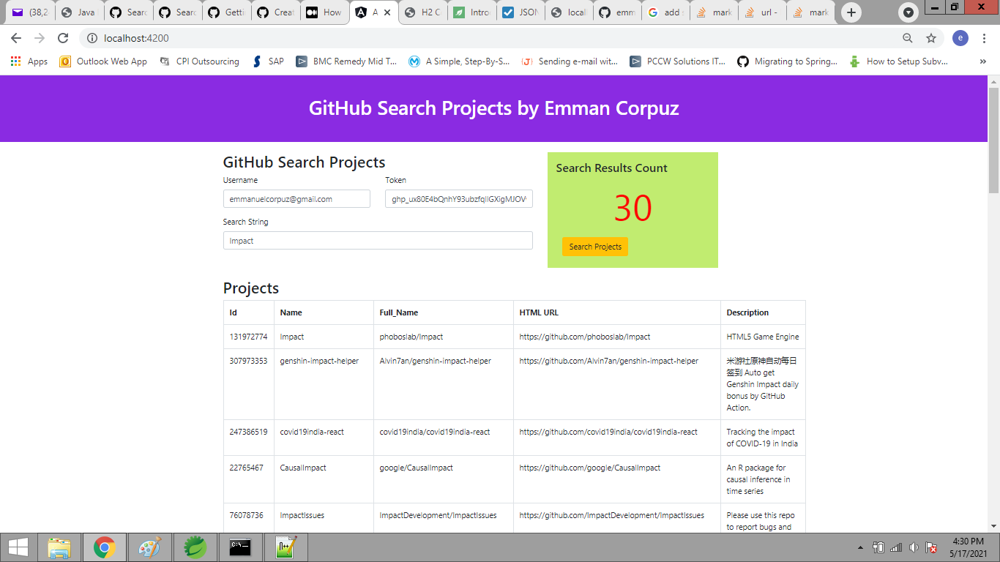

# GitHub-Search-Projects

It is a Java-Angular Web application that fulfills the
following requirements:

- A user should be able to search for a public project (also called repository) hosted on the
 GitHub platform.
 
Prerequisites:

There are some prerequisites.
- Java
- Angular CLI
- Typescript
- VSCode
- ngx-bootstrap
- Maven
- Github personal access token

You can clone it and run it on your machine.

// clone the project

git clone https://github.com/bbachi/angular-java-example.git

// Run Angular on port 4200

cd /src/main/ui

npm install

npm start

// Run Java Code on 8080

mvn clean install

java -jar target/users-0.0.1-SNAPSHOT.jar

Site Address (see site UI screenshot below):

http://localhost:4200/

REST Endpoint example:

http://localhost:8080/webfont/project/string_to_search?username=github_username@gmail.com&token=github_personal_access_token

